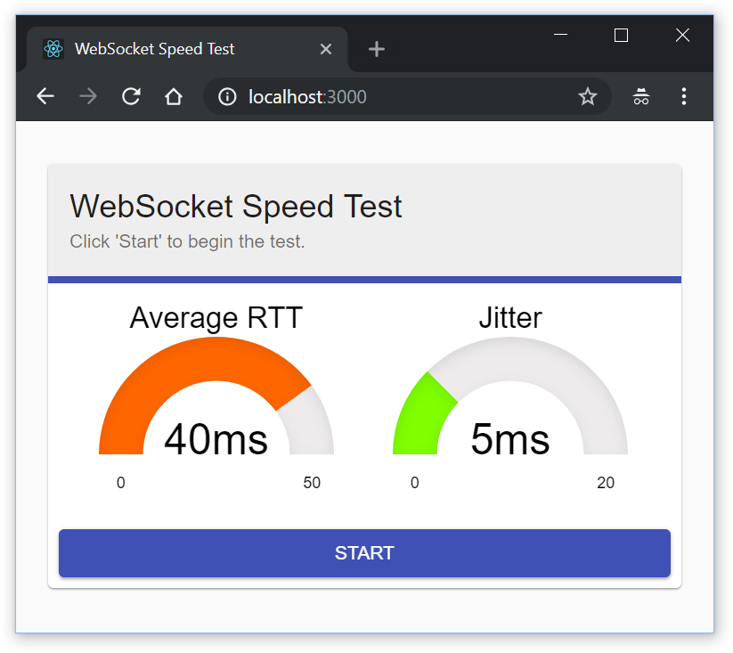

# WebSocket Speed Test #

A little Java, React and Material UI app to perform some calculations on the websocket connection between browser and server.



To run, execute:

```
docker run -p 8080:8080 registry.gitlab.com/dansiviter/websocket-speedtest/master:<commit-sha>
```